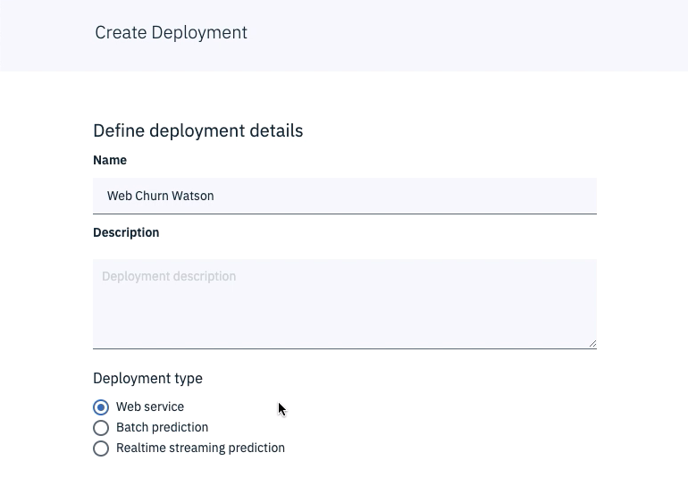

## Viejo Instructivo para crear un Watson Machine Learning Model

> Deprecated, fue reemplazado por AutoAI en Julio 2019

* En el panel de _Assets_ navega hacia abajo a la sección de _Watson Machine Learning_
* Haz click en _New Watson Machine Learning model_

* Dale un nombre a modelo
* Selecciona en _Runtime_ el ambiente _Default Spark Scala 2.11_
* Selecciona la opción _Manual_ para poder seleccionar los modelos que se probaran.
* Haz click en _Create_ para crear el modelo

* En el paso _Data Assets_, selecciona el set que se creo apartir del Data Flow del numeral anterior.
* Haz click en _Next_
* En el paso _Technique_ selecciona como _Column value to predict_ la columna objetivo _Exited_
* Asegurate que la tecnica sugerida sea _Binary Classification_

* Haz click en _Add Estimators_ para seleccionar los modelos que evaluaremos.
* Selecciona todos los estimadores y haz click en _Add_

* Haz click en _Next_ para que comience el entrenamiento de los modelos.
* Espera a que los modelos terminen de entrenar.
* Analiza los resultados de los modelos
* Selecciona el mejor model, tipicamente es el _RandomForestClassifier_ y haz click en el botón _Save_

* Ve al tab _Deployments_ y haz click en _Add Deployment_
* Dale un nombre al Despliegue
* Selecciona el metodo de despliege _Web Service_
* Haz click en _Save_

* Espera hasta que el estado del despliegue diga `DEPLOY_SUCCESS` y haz click sobre el nombre del despliegue.

* Navega en la pestaña _Implementation_ para entender como hacer los llamados a través de REST APIs
* Navega en la pestaña _Test_ y haz un llamado al modelo.

